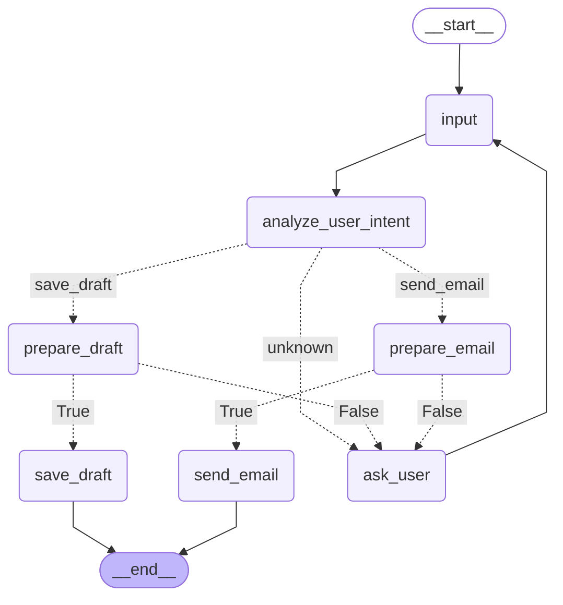

# Email workflow

```mermaid
---
config:
  flowchart:
    curve: linear
---
graph TD;
	__start__([<p>__start__</p>]):::first
	input(input)
	analyze_user_intent(analyze_user_intent)
	prepare_draft(prepare_draft)
	prepare_email(prepare_email)
	save_draft(save_draft)
	send_email(send_email)
	ask_user(ask_user)
	__end__([<p>__end__</p>]):::last
	__start__ --> input;
	analyze_user_intent -. &nbsp;unknown&nbsp; .-> ask_user;
	analyze_user_intent -. &nbsp;save_draft&nbsp; .-> prepare_draft;
	analyze_user_intent -. &nbsp;send_email&nbsp; .-> prepare_email;
	ask_user --> input;
	input --> analyze_user_intent;
	prepare_draft -. &nbsp;False&nbsp; .-> ask_user;
	prepare_draft -. &nbsp;True&nbsp; .-> save_draft;
	prepare_email -. &nbsp;False&nbsp; .-> ask_user;
	prepare_email -. &nbsp;True&nbsp; .-> send_email;
	save_draft --> __end__;
	send_email --> __end__;
	classDef default fill:#f2f0ff,line-height:1.2
	classDef first fill-opacity:0
	classDef last fill:#bfb6fc

```
